  

# 🚀 Awesome Work Management 📊

  
  
  
  
  

> **A curated, SEO-optimized list of top SaaS products and open-source GitHub projects for work management, project planning, task tracking, and team productivity.** 🎯

---

## 💡 Overview & Key Concepts

Work management platforms enable teams to plan projects, assign tasks, track progress, manage digital resources, and foster cross-departmental collaboration. Whether you are looking for visual Kanban boards, enterprise PMO suites, or privacy-first self-hosted task trackers, this guide categorizes top solution ecosystems.

---

## 📈 Market Size & Industry Dynamics

> 🌐 **Estimated Market Size & Structure:** The global Project & Work Management Software market size is estimated at **~$11.77 Billion in 2026** and projected to expand past **$37 Billion by 2034**. The sector is **moderately fragmented**, undergoing rapid transformation toward AI-driven strategic orchestration. While enterprise tech giants (Microsoft, Atlassian) hold dominant market shares, agile Work OS vendors (Monday.com, Notion, Smartsheet) and open-source platforms retain high growth and strong niche differentiation.

---

## 🏢 SaaS & Hosted Platforms

> Sorted in descending order by company valuation / market capitalization / revenue scale. 💰

| 🛠️ Platform | 🏢 Company Size / Valuation / Revenue | 💳 Starting Paid Tier | 🎁 Free Tier & Trial Limits | 📌 Key Features & Focus |
| :--- | :--- | :--- | :--- | :--- |
| **[Microsoft Planner](https://www.microsoft.com/microsoft-365/business/task-management-software)** 💼 | **~$3.0+ Trillion Market Cap** *(Microsoft parent)* | $10.00 / user / mo | Included in M365 Business plans (1 month free trial available) | Kanban boards, deep Outlook & Teams integration, M365 ecosystem task sync |
| **[Jira Work Management](https://www.atlassian.com/software/jira/work-management)** 🏷️ | **~$30+ Billion Market Cap** *(Atlassian parent, ~$4.5B ARR)* | $7.91 / user / mo | Free up to **10 users** (2 GB storage, community support) | Agile/Scrum backlog tracking, business team workflows, Atlassian suite integration |
| **[Trello](https://trello.com/)** 🎴 | **~$30+ Billion Market Cap** *(Atlassian subsidiary)* | $5.00 / user / mo | Free for **unlimited users** (max 10 workspace boards, 10MB file attachments) | Minimalist visual Kanban boards, Power-Ups, fast lightweight task organization |
| **[Notion](https://www.notion.so/)** 📝 | **$11.0 Billion Valuation** (~$865M ARR) | $10.00 / user / mo | Free forever for **individuals** (unlimited blocks, 5MB file upload limit, 10 guests) | All-in-one workspace combining notes, flexible databases, wikis, and Kanban |
| **[Smartsheet](https://www.smartsheet.com/)** 📊 | **$8.4 Billion Valuation** *(Acquired by Blackstone/Vista)* | $9.00 / user / mo | Free for **1 user** (up to 2 sheets, 500MB storage); 30-day full free trial | Grid/spreadsheet-based work management, Gantt charts, PMO governance & automations |
| **[Monday.com](https://monday.com/)** 🎨 | **~$4.0+ Billion Market Cap** (~$1.37B TTM Revenue) | $9.00 / seat / mo | Free for **up to 2 seats** (max 3 boards, 200+ templates, 500MB storage) | Visual Work OS with customizable columns, dashboards, automation, and CRM views |
| **[Asana](https://asana.com/)** 🎯 | **~$2.2+ Billion Market Cap** (~$809M TTM Revenue) | $10.99 / user / mo | Free for **up to 10 users** (unlimited tasks/projects/activity log, 100MB per file) | Goal tracking (OKRs), project timelines, task dependencies, cross-team workflows |
| **[Airtable](https://airtable.com/)** 🗃️ | **$11.0 Billion Valuation** (~$480M ARR) | $15.00 / user / mo | Free for **unlimited seats** (up to 1,000 records per base, 1GB attachments per base) | Relational database hybrid, custom workflow builder, low-code app creation |
| **[ClickUp](https://clickup.com/)** ⚡ | **$4.0 Billion Valuation** (~$150M+ ARR) | $7.00 / user / mo | Free forever for **unlimited users & tasks** (100MB storage limit, 100 uses of custom fields) | All-in-one productivity suite combining tasks, docs, whiteboards, chat, and time tracking |
| **[Wrike](https://www.wrike.com/)** 📁 | **~$1.5+ Billion Valuation** (~$200M ARR) | $10.00 / user / mo | Free for **unlimited users** (2GB storage, basic task management, web/desktop/mobile) | Enterprise work management, proofing, resource allocation, and portfolio reporting |

---

## 🔓 Open-Source GitHub Projects

> Sorted in descending order by GitHub Star counts. ⭐️ Click badges to inspect stargazers! 

| 📦 Project & Link | ⭐️ Star Count | 📜 License | 🛠️ Tech Stack & Key Highlights |
| :--- | :--- | :--- | :--- |
| **[Plane](https://github.com/makeplane/plane)** ✈️ |  | AGPL-3.0 | Python/Django, Next.js, Docker. Modern AI-native Jira/Linear alternative with Cycles, Modules, and Pages. |
| **[AppFlowy](https://github.com/AppFlowy-IO/AppFlowy)** 📱 |  | AGPL-3.0 | Flutter, Rust. Open-source Notion alternative with offline-first data sovereignty and customizable building blocks. |
| **[Focalboard](https://github.com/mattermost-community/focalboard)** 📋 |  | MIT / AGPL | Go, TypeScript, React. Self-hosted Trello and Notion alternative maintained by Mattermost community. |
| **[OpenProject](https://github.com/opf/openproject)** 🏛️ |  | AGPL-3.0 | Ruby on Rails, Angular. Enterprise project management with Gantt charts, Agile boards, cost tracking & XWiki integration. |
| **[Leantime](https://github.com/Leantime/leantime)** 🎯 |  | AGPL-3.0 | PHP, Vue.js. Accessibility-first project management designed for non-project managers with ADHD/neurodiversity features. |
| **[Taiga](https://github.com/kaleidos-ventures/taiga-back)** 🦎 |  | AGPL-3.0 | Python, AngularJS. Agile project management platform for Scrum and Kanban software development teams. |
| **[Wekan](https://github.com/wekan/wekan)** 🃏 |  | MIT | Meteor, Node.js. Open-source Trello clone with swimlanes, drag-and-drop, and multi-language support. |
| **[Kanboard](https://github.com/kanboard/kanboard)** 📌 |  | MIT | PHP, SQLite/MySQL. Minimalist, lightweight Kanban board focused on simplicity and low resource usage. |
| **[Taskwarrior](https://github.com/GothenburgBitFactory/taskwarrior)** 💻 |  | MIT | C++. Fast, feature-rich command-line todo and task management tool for terminal power users. |
| **[Vikunja](https://github.com/go-vikunja/vikunja)** 📝 |  | AGPL-3.0 | Go, Vue.js. Hierarchical task manager with smart recurring tasks, Gantt view, and Telegram integration. |
| **[Redmine](https://github.com/redmine/redmine)** 🔴 |  | GPL-2.0 | Ruby on Rails. Flexible multi-project tracking tool with issue management, wiki, forums, and Gantt charts. |
| **[Paca](https://github.com/Paca-AI/paca)** 🤖 |  | AGPL-3.0 | TypeScript, React, Docker. AI-native workspace with Model Context Protocol (MCP) server integration for AI agents. |
| **[WorkBase](https://github.com/vocso-com/WorkBase)** 🖥️ |  | MIT | Rust, Tauri, React. Local-first desktop PM software with unlimited task nesting and progress rollups. |
| **[4ga Boards](https://github.com/RARgames/4gaBoards)** 🎛️ |  | MIT | Node.js, Vue. Real-time Kanban board software with dark mode and multitasking utility tools. |
| **[Orangescrum](https://github.com/Orangescrum/opensource-community-edition)** 🍊 |  | AGPL-3.0 | PHP 8.2 (CakePHP 4), PostgreSQL. Self-hosted project management with no seat limits or paid tier locks. |
| **[Project Manager](https://github.com/Boisti13/project-manager)** 📅 |  | MIT | FastAPI, React, PostgreSQL. Self-hosted task manager with timeline/Gantt view, recurring tasks, and Proxmox LXC setup. |

---

## 🤝 How to Contribute

Contributions are welcome! Please follow these steps to add new work management tools or update existing entries:

1. 🍴 **Fork** this repository.
2. 📝 Edit `README.md` to add your tool (maintaining table structure and sorting order).
3. 🔍 Ensure description includes key features, starting pricing, free tier limits, or repository star badges.
4. 📬 Submit a **Pull Request** with a concise description of your additions.

---

## 💖 Support & Community

Thank you for visiting and using **Awesome Work Management**! If you find this curated list valuable for your projects or team workflows, please consider supporting the project:

- ⭐️ **Star** this repository to help others discover it on GitHub.
- 🍴 **Fork** and share it with your network, team, or open-source community.
- ☕ **Buy me a coffee / Sponsor:** Support ongoing open-source curation and development via [GitHub Sponsors Dashboard](https://github.com/sponsors/ishandutta2007).

---

## ⚖️ Disclaimer

This repository is a community-curated collection intended for educational and informational purposes. Product logos, trademarks, and brand names belong to their respective owners. Self-hosted software deployments should be hardened according to security best practices.

---

## 📊 Star History

---

  <b>Made with ❤️ for project managers, team leads, developers, and productivity enthusiasts.</b>

